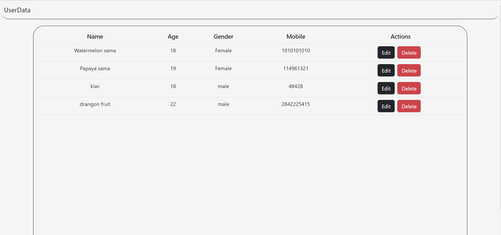
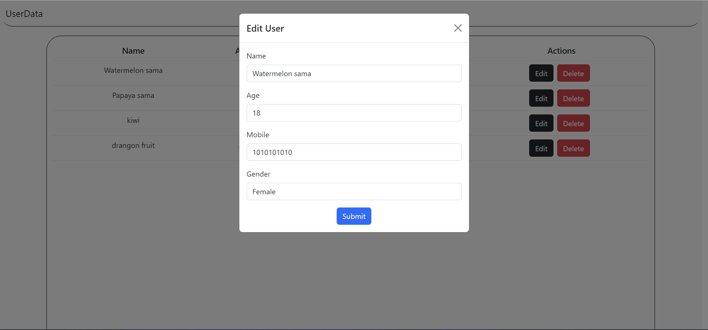
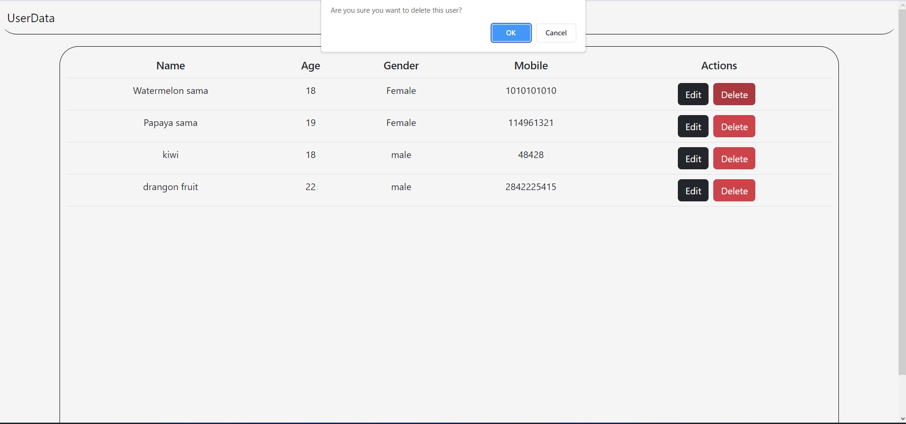

# 📊 UserData Web App

FYI : DEMO VID AND SS AVAILABLE

Welcome to the UserData web app, a MEAN stack application that allows you to store, edit, and delete personal information in a secure and organized manner. The Angular frontend fetches data from a MongoDB server and displays it on the web app, where you can easily manage your user data.

## 🚀 Getting Started

To get started with the app, you will need to have Node.js and MongoDB installed on your local machine. Then, follow these steps:

1. Clone the repository to your local machine.
2. Open the terminal and navigate to the project directory.
3. Run `npm install` to install the dependencies.
4. Run `ng serve` to start the app.
5. Open your browser and navigate to `http://localhost:4200/`.

You should now be able to see the web app running on your local machine.

## 💻 Usage

Once you're on the app, you can view your existing user data by navigating to the "Users" page. Here, you'll see a list of all the users currently in the database.

To edit or delete a user, simply click on their name to open their profile. From there, you can make any necessary changes and hit "Save" to update the user's information. Alternatively, you can click "Delete" to remove the user from the database.

## 🔒 Security

The app is designed with security in mind. All user data is stored on a secure MongoDB server and encrypted to ensure that no unauthorized access occurs. Authentication mechanisms are in place to protect user information and prevent unauthorized editing or deletion.

## 🤝 Contributing

Contributions to the UserData web app are always welcome! Feel free to submit a pull request or open an issue if you run into any problems or have suggestions for improvement.

##  📸 Screenshots

## 📺[Demo Video](https://youtu.be/7n0G_BaAF4Q)

## 💻 [Backend Code](https://github.com/JaeAeich/UserData-backend.git)

## 🙏 Acknowledgements

This project was made possible thanks to the MEAN stack and the countless resources and tutorials available online. Special thanks to the open-source community for their contributions to web development.

Happy coding! 😄
